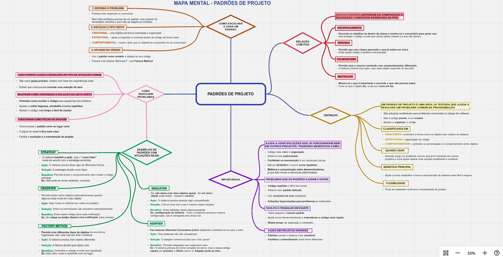

# Mapa Mental – Padrões de Projeto

Mapa mental simples e visual para revisar os principais **Padrões de Projeto**, sua relação com **POO**, quando usar e quais benefícios trazem.

> O arquivo do mapa está neste repositório como **PNG** para visualização rápida.

## Visualizar

Clique na imagem abaixo para abrir em tela cheia:

Se preferir baixar:
- Clique no arquivo **mapa-mental-padroes-projeto.png** na lista de arquivos do repositório.
- Depois clique no botão **Download**

## O que o mapa cobre

- **O que são Padrões de Projeto**  
  Ideias testadas para resolver problemas recorrentes de design de software.

- **Relação com POO**  
  Encapsulamento • Herança • Polimorfismo • Abstração.

- **Classificações**
  - **Criacionais** – como criar objetos (ex.: *Factory Method*, *Singleton*).  
  - **Estruturais** – como organizar/combinar classes/objetos (ex.: *Adapter*, *Facade*).  
  - **Comportamentais** – como os objetos se comunicam (ex.: *Strategy*, *Observer*).

- **Quando usar**  
  Ao reconhecer problemas comuns que já foram resolvidos em outros projetos.

- **Benefícios**  
  Reuso • Organização • Manutenção facilitada • Flexibilidade.

- **Exemplos citados**  
  *Strategy*, *Observer*, *Factory Method*, *Singleton*, *Adapter*.

## Autora

**Cintia Oliveira**  
Mapa criado no **Miro** e disponibilizado neste repositório para estudo e referência.

## Licença

Este material é disponibilizado para **uso educacional**.  
Sinta-se à vontade para clonar e estudar. Ao reutilizar, dê os devidos créditos.
